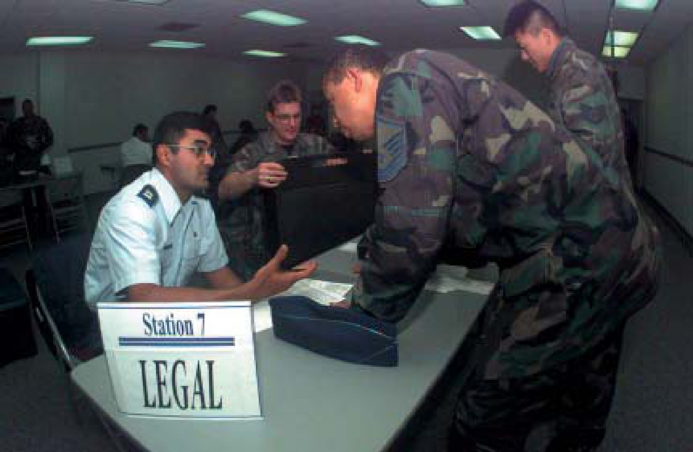
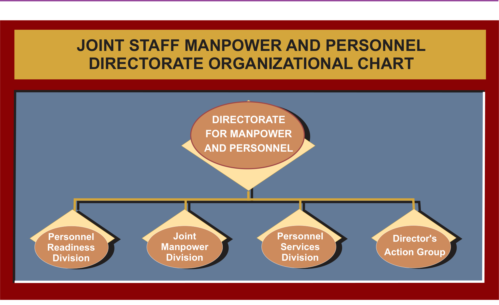

# PREFACE

## 1 Scope

Joint Publication 1-0 is a keystone document within the joint doctrine publication system. It provides doctrine for planning, coordinating, and providing personnel support to joint operations. It also provides information relating to the functions, authorities, and responsibilities of a combatant commander (CCDR), joint force commander (JFC) and staffs, and the Service components as they relate to personnel management and selected activities that support the personnel needs of the joint force.

## 2 Purpose

This publication has been prepared under the direction of the Chairman of the Joint Chiefs of Staff. It sets forth joint doctrine to govern the activities and performance of the Armed Forces of the United States in operations and provides the doctrinal basis for interagency coordination and for US military involvement in multinational operations. It provides military guidance for the exercise of authority by CCDRs and other JFCs and prescribes joint doctrine for operations and training. It provides military guidance for use by the Armed Forces in preparing their appropriate plans. It is not the intent of this publication to restrict the authority of the JFC from organizing the force and executing the mission in a manner the JFC deems most appropriate to ensure unity of effort in the accomplishment of the overall objective.

## 3 Application

a. Joint doctrine established in this publication applies to the commanders of combatant commands, subunified commands, joint task forces, subordinate components of these commands, combat support agencies, and the Services.

b. The guidance in this publication is authoritative; as such, this doctrine will be followed except when, in the judgment of the commander, exceptional circumstances dictate otherwise. If conflicts arise between the contents of this publication and the contents of Service publications, this publication will take precedence unless the Chairman of the Joint Chiefs of Staff, normally in coordination with the other members of the Joint Chiefs of Staff, has provided more current and specific guidance. Commanders of forces operating as part of a multinational (alliance or coalition) military command should follow multinational doctrine and procedures ratified by the United States. For doctrine and procedures not ratified by the United States, commanders should evaluate and follow the multinational command’s doctrine and procedures, where applicable and consistent with US law, regulations, and doctrine.

# EXECUTIVE SUMMARY - COMMANDER’S OVERVIEW  

- Outlines the Organization, Functions, and Principles of Personnel Support  
- Provides a Discussion of Personnel Support Roles and Responsibilities  
- Discusses Manning of a Joint Task Force Headquarters  

## Organization, Functions, and Principles of Personnel Support  

**Personnel support is a combat multiplier for the joint force.**  

Integrated personnel support is a vital component of operational readiness and, when executed properly, becomes a combat multiplier for the joint force. To accomplish this, Service components must resource personnel requirements in a timely manner. The joint force commander (JFC) and the manpower and personnel directorate of a joint staff (J-1) continually maintain visibility of personnel issues to adequately sustain the force and maintain readiness.  

Authorization and guidance for implementation of personnel programs in support of joint operations are set forth in titles 5, 10, and 39 of the United States Code, Department of Defense (DOD) directives, and Chairman of the Joint Chiefs of Staff (CJCS) instructions.  

**The joint manpower and personnel directorate organization.**

Through the contingency and crisis action planning processes, the J-1 assists the JFC in selectively tailoring a unique package of personnel programs for every joint operation. A joint force J-1 may be organized into but not limited to the following four areas:  

- **Manpower** provides policy oversight on joint manpower and management of joint forces and US contributions to multinational military organizations  

- **Personnel readiness** provides plans, policy, and guidance on joint personnel issues, to include oversight of joint personnel operations.  

- **Personnel services** administers internal staff, DOD civilian, and military members of the joint force.  

- **Director’s action group** reviews policies pertaining to the separation/retirement of military personnel, concurrent receipt, survivor benefits, veterans issues, assignment policy, force realignment and transformation, quality of life issues, compensation, and recruiting and retention.

Personnel support is critical to the success of any operation, and therefore cannot be left to chance or relegated to a minor role. Ensuring the proper planning and execution of personnel support activities are a JFC responsibility and must receive high priority.

## Roles and Responsibilities

**Department of Defense Responsibilities.**

The Secretary of Defense establishes policy, assigns responsibilities, and prescribes procedures for personnel readiness issues as they apply to all members and components. CJCS, in consultation with the other members of the Joint Chiefs of Staff, provides advice to the Secretary of Defense on manpower and personnel issues and the force structure required to support attainment of national security objectives. The Services have responsibility for providing personnel support to their forces. Combatant commanders (CCDRs) exercise combatant command (command authority) over assigned forces. Service component commanders normally provide personnel support to Service forces assigned to joint commands.

**Director for Manpower and Personnel.**

The J-1 develops joint plans, policy, and guidance on manpower and personnel issues. Additionally, the J-1 coordinates manpower and personnel support to ensure success of ongoing peacetime, contingency, and wartime operations. The J-1 is the principal staff agency for manpower and personnel support and is responsible for synchronizing the efforts of Service components to optimize personnel support to the joint force. To do this, J-1 has primary responsibility for manpower management; personnel augmentation; joint personnel training and tracking activities; personnel accountability and strength reporting; rotation policies; civilian employees; pay and entitlements; postal operations; morale, welfare, and recreation; casualty reporting; and awards and decorations. In addition, the J-1 provides support and assistance to the office of primary responsibility with regard to Reserve Component call-up; stop-loss; noncombatant evacuation operations and noncombatant repatriation; personnel recovery operations; and detainee operations. Furthermore, the J-1 must be fully involved in all phases of contingency and crisis action planning to support effective planning for personnel support to joint operations, thereby leveraging the joint force’s ability to accomplish the mission.

## Joint Task Force Headquarters

**Manning a joint task force headquarters.**

A joint task force headquarters (JTF HQ) can be established by designating a Service component or any suitable, subordinate unit headquarters to serve as a JTF HQ, by forming the JTF HQ entirely from the combatant command staff, or by combining the assets from the combatant command staff with those of the Service components. Every effort should be made to fill joint task force (JTF) augmentation requirements from the combatant command resources.

The standing joint force headquarters core element (SJHQ (CE)) is a full-time, joint, command and control element within the combatant command staff, which can be employed with three options. First, the SJHQ (CE) can form the core of a JTF HQ; another option is to augment a Service component headquarters with the SJHQ (CE); and finally, the SJHQ (CE) can support the combatant command headquarters.

**Joint task force manning document.**

A key factor to effectively transition a single-Service organization from its routine Service-related missions to that of a JTF HQ is creating a joint manning document (JMD) for contingency operations that will define the organization and provide the basis for tasking the individual augmentee requirements. The commander, JTF, in concert with the establishing commander’s staff, develops and organizes a draft JTF JMD that will be forwarded for the supported establishing commander’s validation and approval. This document provides the baseline for JTF HQ staffing and is used for strength reporting, personnel accounting, awards eligibility determination, base support, and a host of other services and functions. The end product of this coordination will be a validated JMD, listing positions by paragraph, line number, duty title, grade, branch of Service, skill/specialty code, security clearance, and special remarks. Once the tasking message is released, the JTF JMD becomes an official document, the maintenance of which is the responsibility of the establishing command J-1.

## CONCLUSION

This publication is a keystone document within the joint doctrine publication system. It provides doctrine for planning, coordinating, and providing personnel support to joint operations. It also provides information relating to the functions, authorities, and responsibilities of a CCDR, subordinate JFC, and staffs, and the Service components as they relate to personnel management and selected activities that support the personnel needs of the joint force.

# CHAPTER I - ORGANIZATION, FUNCTIONS, AND PRINCIPLES OF PERSONNEL SUPPORT

> *"The teams and staffs through which the modern commander absorbs information and exercises his authority must be a beautifully interlocked, smooth working mechanism. Ideally, the whole should be practically a single mind."*
> 
> **General Dwight D. Eisenhower**

## 1 General

a.  This chapter covers functions, organization, and principles of the manpower and personnel directorate of a joint staff (J-1), as well as essential elements of personnel support to joint operations. For purposes of this publication, “personnel support” refers to either the activities associated with assignment of personnel against authorized billets and validated individual augmentation requirements, or to those administrative activities associated with personnel programs within a command, dependent upon the context within which it is used.

b.  People are the most important asset in any military operation. Thorough planning and comprehensive personnel management directly impact mission readiness.

c.  Integrated personnel support is a vital component of operational readiness and, when executed properly, becomes a combat multiplier for the joint force. To accomplish this, Service components must resource personnel requirements in a timely manner. The joint force commander (JFC) and the J-1 staff continually maintain visibility of personnel manning levels to adequately sustain the force and maintain readiness.

## 2 Authorities

a.  The joint nature of US military operations makes it imperative that JFCs fully understand and exercise their authority to implement personnel programs and coordinate the personnel support functions of their Service components.

b.  Authorization and guidance for implementation of personnel programs in support of joint operations are set forth in titles 5, 10, and 39 of the United States Code (USC), and Department of Defense directives (DODDs), and Chairman of the Joint Chiefs of Staff instructions (CICSIs). Through the contingency planning and crisis action planning (CAP) processes, the J-1 assists the JFC in selectively tailoring a unique package of personnel programs for every joint operation.

c.  While personnel services support requirements must be coordinated and integrated throughout the operation, each Service and combat support agency (CSA) retains its own distinct culture, traditions, and requirements. Services and Service components will retain authority for personnel support to their forces assigned or attached to joint commands, subject to the coordinating guidance of the J-1 issued under the authority of the JFC. For contingency operations, home station is responsible for all personnel services due to the short time the joint task force (JTF) will have their service.

## 3 Function of the Joint Force Manpower and Personnel Directorate

A joint force J-1's function is to coordinate timely and effective personnel support to JFCs.

## 4 Organization of the Joint Force Manpower and Personnel Directorate

The J-1 section of a joint force headquarters may be organized as outlined in Figure I-1.

a. **Personnel readiness** provides plans, policy, and guidance on joint personnel issues, to include oversight of joint personnel operations. Personnel readiness plans include development of the manpower mobilization requirements for Appendix 5 to Annex A of operation plans (OPLANs).

b. **Manpower** provides policy oversight on joint manpower and management of joint forces and US contributions to multinational military organizations.

c. **Personnel services** administers internal staff, Department of Defense (DOD) civilian, and military members of the joint force. It also includes limited administrative requirements related to DOD contractors deploying with the force (CDF).

d. Director’s action group reviews policies pertaining to the separation/retirement of military personnel, concurrent receipt, survivor benefits, veterans issues, assignment policy, force realignment and transformation, quality of life issues, compensation, and recruiting and retention.

## 5 Principles of Personnel Support Within a Joint Force Command

a. **Command Emphasis.** Personnel support is critical to the success of any operation, and therefore cannot be left to chance or relegated to a minor role. Ensuring the proper planning and execution of personnel support activities is a JFC’s responsibility and must receive high priority. The JFC must:

(1) Communicate the strategic and operational objectives to the J-1 early in the planning process, and refine them as mission requirements change over time.

(2) Thoroughly understand personnel estimates and plans developed to support mission objectives.

(3) Ensure personnel requirements are adequately identified and prioritized; and that specific skills requirements are forecast (i.e., foreign area language or specialty skills).

b. **Focal Point for All Personnel Support Actions.** The J-1 is the focal point for personnel actions and, at a minimum, must:

(1) Participate in all decision and planning processes, emphasizing the integration of force structure, personnel sustainment, and support concepts into each phase of the operation.

(2) Advise the JFC and staff on personnel-related areas of concern which may impact operations and available alternatives.

(3) Advise the JFC and staff on Reserve Component (RC) unique personnel, military pay support requirements, leave accrual and policy, mobilization and demobilization processing requirements, and time limitations.

c. **Synchronization of Personnel Support.** Planning and execution of personnel support has a significant impact on other areas (i.e., logistics and maneuver). The J-1 must coordinate with other staff directorates to synchronize personnel support efforts for all possible operational requirements during every phase of the operation.

d. **Unity of Effort.** Unity of effort is necessary to effectively conduct a joint operation. It results from the synergistic combination of capabilities residing in all supporting commands and agencies. Timely and effective personnel support is accomplished through detailed J-1 planning and coordination with supporting organizations.

e. **Flexibility in Adapting to Changing Situations.** The J-1 must be flexible in responding to changing situations, unanticipated events, and personnel-related requirements. Personnel support programs, policies, techniques, and procedures should be adaptable to changing operational situations, needs, and priorities. During domestic contingency operations, personnel support may remain with the home station (situation dependent).
